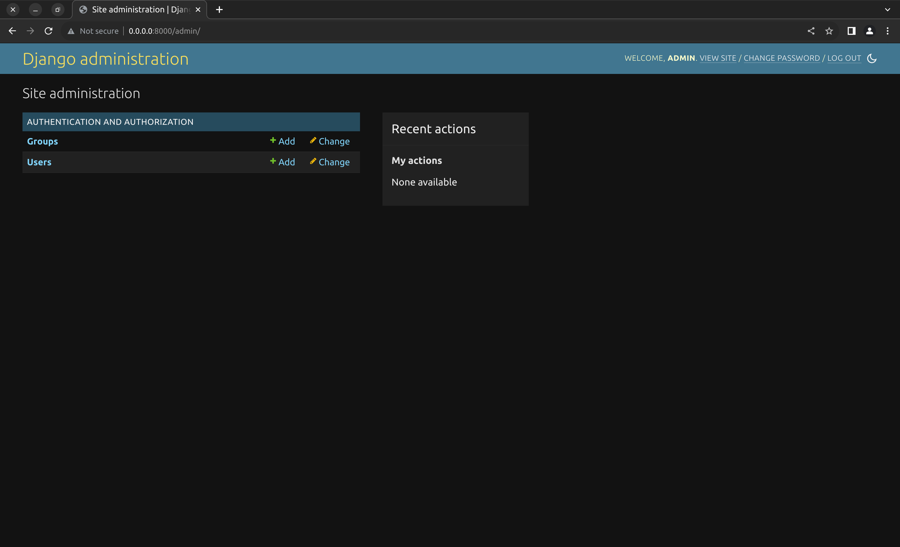
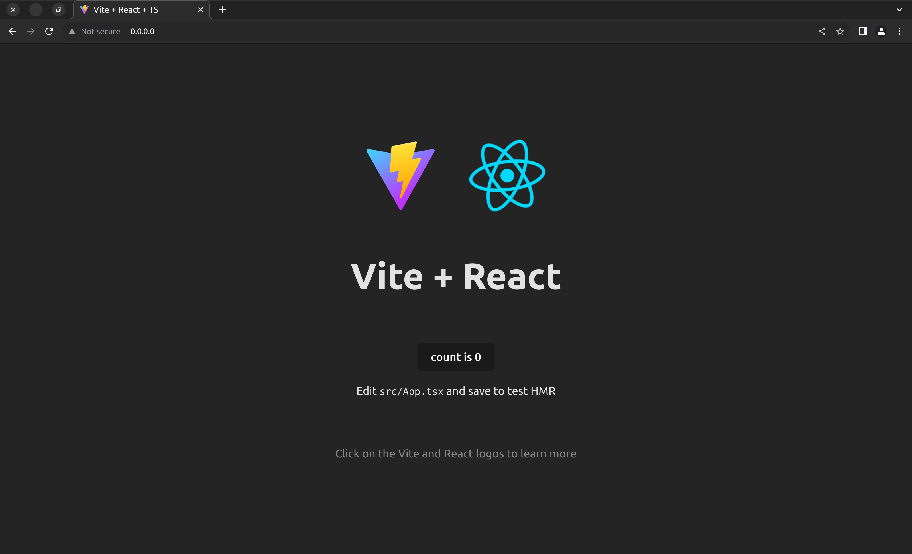

<p align="center">
  <p align="center">
    <a href="https://www.youtube.com/@codingforinnovations" target="_blank">
          
    </a>
  </p>
  <p align="center">
    For Programmers, By Programmers.
  </p>
</p>

# Django & React with Docker, Postgres, Nginx

>A Bootstrapped Template of Django with React using Docker, Postgres Database and Nginx!

Embark on a comprehensive journey into the world of full-stack development! Join us for an in-depth exploration of integrating Django, React, Docker, Postgres, and Nginx. This walkthrough offers a step-by-step guide, empowering you to master the seamless integration of these powerful technologies. Unlock the potential of this robust stack and elevate your development skills to build scalable, modern web applications.

### Youtube Video: [Link](https://www.youtube.com/watch?v=ZV4I9vgCwN0)

## 📚 Stack:

- [Python](https://www.python.org/) - Python is a programming language that lets you work quickly and integrate systems more effectively.
- [Django](https://www.djangoproject.com/) - Django makes it easier to build better web apps more quickly and with less code.
- [Typescript](https://www.typescriptlang.org/) - JavaScript with syntax for types.
- [React](https://react.dev/) - The library for web and native user interfaces.
-  [Docker](https://www.docker.com/)  - Docker is a platform designed to help developers build, share, and run modern applications. We handle the tedious setup, so you can focus on the code.
- [Nginx](https://www.nginx.com/) - Advanced Load Balancer, Web Server, & Reverse Proxy.
-   [Postgres DB](https://www.postgresql.org/)  - The World's Most Advanced Open Source Relational Database.

## 📸 Screenshots:
- Django Admin Panel:
 

- Nginx:
 


## 📁 Project structure:

```
$PROJECT_ROOT
│  
├── apps/backend  # Django Backend
│  
├── apps/docker  # Docker files for backend, frontend, nginx
│  
├── apps/frontend  # React App.
│   
├── apps/backend/requirements.txt # Python Requirements
│
├── apps/backend/manage.py # Run Django Commands
│
├── apps/frontend/package.json # npm commands
│
├── docker-compose.yaml # compose file for services
```


##  🏆Getting Started: 

- Clone repository 

```bash
mkdir ~/Dev/dj-react -p
cd ~/Dev/dj-react
git clone https://github.com/codingforinnovations/django-react-postgres .
```  
### Docker Setup:

- Create  `.env`  file:
Add Your Credentials  `.env`  from  `sample.env`:

```bash
POSTGRES_DB=root
POSTGRES_USER=root
POSTGRES_PASSWORD=root

DJANGO_SUPERUSER_USERNAME=admin
DJANGO_SUPERUSER_PASSWORD=admin
DJANGO_SUPERUSER_EMAIL=admin@admin.com
```
Get your Secret key (or) Passwords  from:
```python
python -c 'from django.core.management.utils import get_random_secret_key; print(get_random_secret_key())'
```

- Start Docker service
```bash
docker compose up --build
```
_Open [localhost](http://localhost) or  [0.0.0.0](http://0.0.0.0) in your favourite browser :)_

### Manual Setup:

- Start DB:
```bash
cd ~/Dev/dj-react
docker compose up db
```

- Set Up for Python as Backend:

```bash
cd ~/Dev/dj-react
python3.10 -m pip install virtualenv
python3.10 -m virtualenv . 
source bin/activate
pip install -r apps/backend/requirements.txt
```

- Run Migrations & Create a Super User:

```bash
cd ~/Dev/dj-react/apps/backend
python manage.py makmigrations
python manage.py migrate
python manage.py superuser
```

- Run Server:

```bash
cd ~/Dev/dj-react/apps/backend
python manage.py runserver
```

Open [localhost:8000/admin](http://localhost:8000/admin) in your favourite browser :)

- Set Up for React as Frontend:

```bash
cd ~/Dev/dj-react/apps/frontend
npm install
```

- Run Server:

```bash
cd ~/Dev/dj-react/apps/frontend
npm run dev
```

Open [localhost:3000](http://localhost:3000) in your favourite browser :)


## 🎫 LICENSE:

[MIT LICENSE](https://github.com/codingforinnovations/django-react-postgres/blob/main/LICENSE)

## 🆕 Change Log:

[Change Log](https://github.com/codingforinnovations/django-react-postgres/commits/main/)

<br />


<div align="center">
<i>Other places you can find us:</i><br>
<a href="https://www.youtube.com/@codingforinnovations" target="_blank"></a>
</div>
